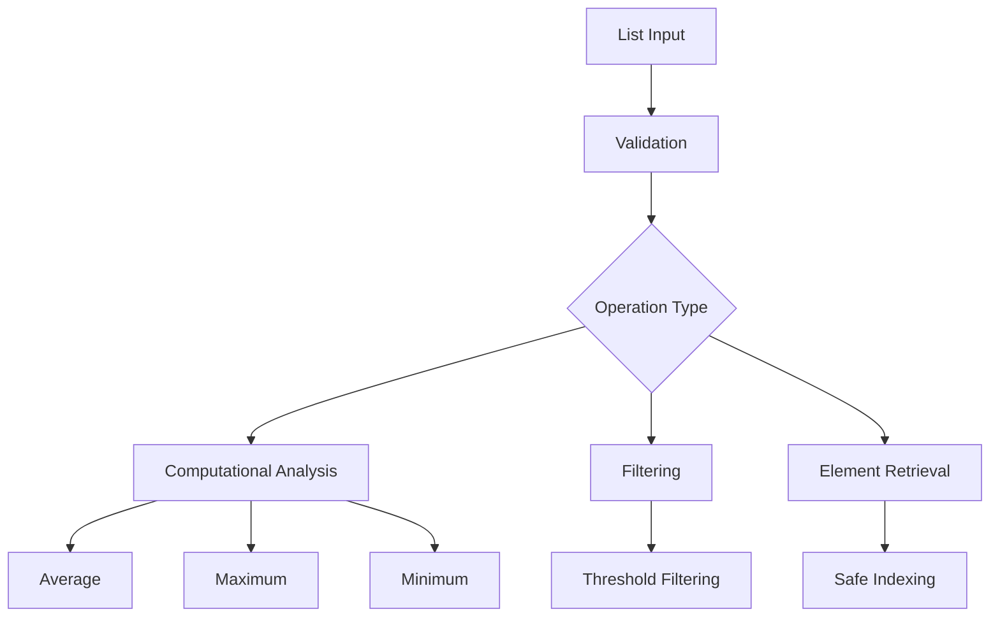

# Calculate List 📊

## Overview

`calculate-list` is an advanced Clarity smart contract that provides robust list manipulation and computational capabilities for blockchain applications. This utility contract enables developers to perform complex list transformations, statistical calculations, and safe list operations directly on the Stacks blockchain.

## Features

- 📈 Statistical Computations
  - Calculate list averages
  - Find maximum and minimum values
  - Safe list element retrieval

- 🔍 List Filtering
  - Advanced filtering with comparison types
  - Length validation
  - Flexible threshold-based filtering

- 🛡️ Safety Mechanisms
  - Input validation
  - Error handling for edge cases
  - Bounded list operations

## Architecture

`calculate-list` provides a comprehensive set of functional operations on lists:



## Contract Functions

### Statistical Operations
```clarity
(list-average (lst (list 100 uint)))
(list-max (lst (list 100 uint)))
(list-min (lst (list 100 uint)))
```

### List Manipulation
```clarity
(filter-list 
  (lst (list 100 uint)) 
  (threshold uint)
  (comparison-type (string-ascii 2))
)
(safe-list-get (lst (list 100 uint)) (index uint))
(validate-list-length (lst (list 100 uint)))
```

## Usage Examples

### Average Calculation
```clarity
(list-average [u10 u20 u30 u40 u50])
;; Returns: (ok u30)
```

### List Filtering
```clarity
(filter-list [u10 u20 u30 u40 u50] u25 "gt")
;; Returns: (ok [u30 u40 u50])
```

### Safe Element Retrieval
```clarity
(safe-list-get [u10 u20 u30] u1)
;; Returns: (ok u20)
```

## Error Handling

The contract includes comprehensive error codes:
- `ERR-EMPTY-LIST`: Prevents operations on empty lists
- `ERR-INDEX-OUT-OF-BOUNDS`: Protects against invalid index access
- `ERR-LIST-TOO-LONG`: Limits list size for gas efficiency

## Development

### Prerequisites
- Clarinet
- Stacks development environment

### Setup
1. Clone repository
2. Install dependencies: `clarinet install`
3. Run tests: `clarinet test`

## Security Considerations

1. Input Validation
- Maximum list length of 100 elements
- Strict type checking
- Comprehensive error handling

2. Computational Limits
- Bounded computational complexity
- Gas-efficient operations
- Predictable resource consumption

## Limitations
- Maximum list size: 100 elements
- Only supports unsigned integers
- Stateless operations

## Contributing

Contributions welcome! Please submit pull requests or open issues.

## License

[Specify your license]